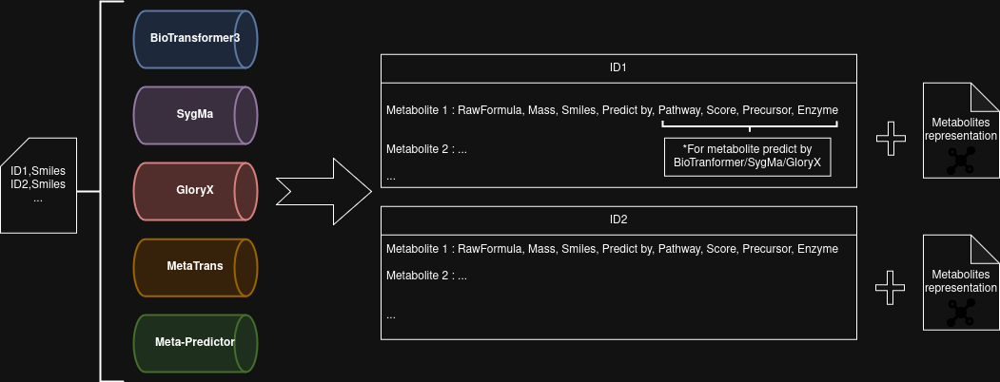

# Metabolite prediction for toxicology

## Overview

*In silico* prediction of a list of molecules whose SMILES code is provided by 4 software packages : **BioTransformer3**, **SyGMa**, **MetaTrans** and **Meta-Predictor**.

Biotransformer and Sygma are used via **singularity**, Meta-Trans & Meta-Predictor need to clone their github.

As this project was designed for non-bioinformaticians, a graphical interface via zenity was included (optional).

This project has been tested and run on **linux** and **windows (WSL)**.

Due to hardware limitations, MetaTrans and Meta-Predictor may not function correctly. Their use is therefore disabled by default.

## Quick start

### Required packages:

- **Singularity** (https://docs.sylabs.io/guides/3.0/user-guide/installation.html) :
  `sudo apt-get install -y singularity-container`
- **Conda** (https://docs.conda.io/projects/conda/en/latest/user-guide/install/index.html) :
  
  `wget https://repo.anaconda.com/miniconda/Miniconda3-latest-Linux-x86_64.sh; chmod +x Miniconda3-latest-Linux-x86_64.sh; ./Miniconda3-latest-Linux-x86_64.sh`
- Necessary for metatrans conda env install : `conda config --set channel_priority flexible`
- Some packages needed : `sudo apt install zenity bc gawk dos2unix csvkit`

### Download project, MetaTrans-MetaPredictor directory and configure them: 

- `git clone https://github.com/alexisbourdais/MetaTox; cd MetaTox/; git clone https://github.com/KavrakiLab/MetaTrans; git clone https://github.com/zhukeyun/Meta-Predictor; mkdir Meta-Predictor/prediction; mv Meta-Predictor/model/SoM\ identifier/ Meta-Predictor/model/SoM_identifier; mv Meta-Predictor/model/metabolite\ predictor/ Meta-Predictor/model/metabolite_predictor; chmod +x Meta-Predictor/predict-top15.sh Metatox.sh`
- download the models in https://rice.app.box.com/s/5jeb5pp0a3jjr3jvkakfmck4gi71opo0 and place them in **MetaTrans/models/** (unarchived)

### Run
- `./Metatox.sh` to activate zenity
- `./Metatox.sh --input input_file` to skip zenity

## Parameters

- `./Metatox.sh -h` to see available parameters when zenity was skipped

      REQUIRED parameter

        -i|--input
  
      OPTIONAL parameter

        -m|--meta       To activate metaTrans and meta-Predictor [No]

        -t|--type       Type of biotransformation to use with BioTransformer3:
                            [allHuman] : Predicts all possible metabolites from any applicable reaction(Oxidation, reduction, (de-)conjugation) at each step 
                            ecbased    : Prediction of promiscuous metabolism (e.g. glycerolipid metabolism). EC-based metabolism is also called Enzyme Commission based metabolism
                            cyp450     : CYP450 metabolism prediction 
                            phaseII    : Prediction of major conjugative reactions, including glucuronidation, sulfation, glycine transfer, N-acetyl transfer, and glutathione transfer, among others 
                            hgut       : Human gut microbial
                            superbio   : Runs a set number of transformation steps in a pre-defined order (e.g. deconjugation first, then Oxidation/reduction, etc.)
                            envimicro  : Environmental microbial

        -n|--nstep      The number of steps for the prediction by BioTransformer [default=1]

        -c|--cmode      CYP450 prediction Mode uses by BioTransformer: 
                            1  = CypReact+BioTransformer rules
                            2  = CyProduct only
                           [3] = CypReact+BioTransformer rules+CyProducts
                    
        -1|--phase1     Number of reaction cycles Phase 1 by SygMa [defaut=1]
        -2|--phase2     Number of reaction cycles Phase 2 by SygMa [defaut=1]

        -p|--tmp        To keep intermediate files [No]

## Documentation

BioTransformer3 : https://bitbucket.org/wishartlab/biotransformer3.0jar/src/master/

SyGMa : https://github.com/3D-e-Chem/sygma

MetaTrans : https://github.com/KavrakiLab/MetaTrans

Meta-Predictor : https://github.com/zhukeyun/Meta-Predictor/tree/main

SdftoSmi & SmitoStr scripts : https://github.com/MunibaFaiza/cheminformatics/tree/main

## Citation

BioTransformer : Djoumbou-Feunang, Y. et al. BioTransformer: a comprehensive computational tool for small molecule metabolism prediction and metabolite identification. J Cheminform 11, 2 (2019)

SyGMa : Ridder, L. & Wagener, M. SyGMa: Combining Expert Knowledge and Empirical Scoring in the Prediction of Metabolites. ChemMedChem 3, 821–832 (2008).

MetaTrans : Litsa, E. E., Das, P. & Kavraki, L. E. Prediction of drug metabolites using neural machine translation. Chem. Sci. 11, 12777–12788 (2020).

MetaPredictor: in silico prediction of drug metabolites based on deep language models with prompt engineering
